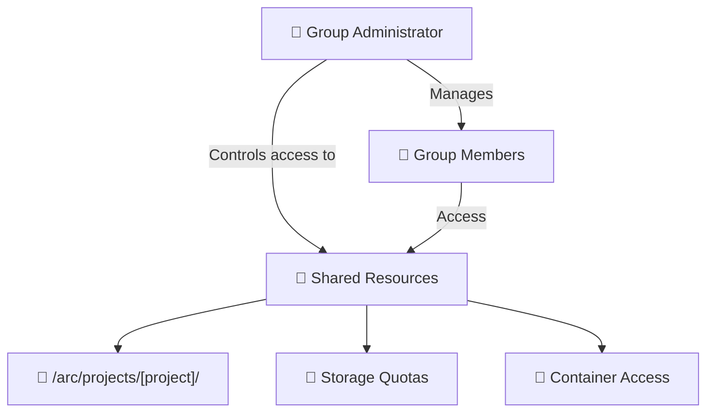

# Accounts & Permissions

Managing users, groups and access control on CANFAR

This section explains user management, group permissions and access control on the CANFAR platform. Whether you're creating a new collaboration or managing an existing team, this guide helps you understand and configure permissions effectively.

!!! abstract "🎯 What you'll learn"
  By the end of this guide, you'll understand:

  - How the CANFAR permission system works
  - How to create and manage research groups
  - How to control access to files and containers
  - How to use APIs for programmatic access

## 🔓 Permissions system

The CANFAR permission system is built from several layers that work together to provide secure, flexible access control:

!!! info "Permission Layers"
  - **CADC account** — your base identity for accessing Canadian astronomy services
  - **Groups** — collections of users for collaborative access
  - **Harbor permissions** — container registry access control
  - **ACL (Access Control Lists)** — fine-grained file permissions on the `/arc` shared file system
  - **API authentication** — programmatic access control

## 👥 Group Management

Groups are the foundation of collaboration on CANFAR. A group defines who can access shared resources, what projects and storage they may use, and how they can interact.

### Group Hierarchy



!!! success "Key Concept"
    Groups enable collaborative research by providing shared access to storage, computing resources, and container images while maintaining security boundaries.

### Creating and Managing Groups

Access the group management interface

[**🔗 CADC Group Management**](https://www.cadc-ccda.hia-iha.nrc-cnrc.gc.ca/en/groups/){ .md-button .md-button--primary }

#### Step 1 — create a new group

1. Click **"New Group"**
2. Provide a meaningful group name (e.g., `cfhtls`)
3. Add a brief description of the project or collaboration
4. Click **Create**

#### Step 2 — add members

1. Find your group in the list
2. Click **"Edit"** in the Membership column
3. Type the person's name (or their CADC username if you know it)
4. Select from the search results
5. Click **"Add member"**

!!! tip "Finding Users"
  The search function uses real names, not CADC usernames. Search for "John Smith" rather than "jsmith".

#### Step 3: Assign Administrators

1. Click **"Edit"** in the Administrators column  
2. Add users who should be able to manage the group
3. Administrators can add/remove members and modify permissions

### Member roles

| Role | Permissions | Best For |
|------|-------------|----------|
| **Administrator** | Full group management, resource allocation | Project leads, team managers |
| **Member** | Access shared resources and collaborate | Team members, contributors |

## 🔐 Harbor Permissions

Harbor is CANFAR's container registry for storing and managing container images. If you aren't building containers, you probably won't need to use it.

!!! info "Registry Access"
  **Registry URL:** [https://images.canfar.net](https://images.canfar.net)

### Access Levels

| Permission Level | Can Do | Cannot Do |
|------------------|--------|-----------|
| **Guest** | Pull public images | Push images, see private repos |
| **Developer** | Pull all group images, push to group repos | Delete images, manage projects |
| **Master** | Full project management | System administration |

### Managing Harbor access

Harbor permissions are usually managed by CANFAR administrators. Contact [support@canfar.net](mailto:support@canfar.net) to:

- request access to a project repository
- set up a new project for your container images
- modify permissions for team members

### Using Harbor

```bash
# Login to Harbor
docker login images.canfar.net

# Pull a container
docker pull images.canfar.net/cadc/astroml:latest

# Push your container (if you have permissions)
docker push images.canfar.net/[project]/[container]:[tag]
```

## 🛡️ Access Control Lists {#acl-access-control-lists}

### What are ACLs?

**Access Control Lists (ACLs)** provide fine-grained permissions on files and directories beyond traditional POSIX permissions. POSIX supports only owner/group/other with read/write/execute; ACLs let you grant specific permissions to additional users and groups.

!!! warning "Important distinction"
  ACLs extend POSIX permissions, allowing multiple users and groups to have different permissions on the same file or directory.

### Why ACLs matter for research

Traditional POSIX limitations:
- only one group can own a file
- no granular control for multiple collaborators
- sharing data across research groups can be awkward

ACL advantages:
- multiple users and groups can have different permissions on the same file
- grant specific researchers read access to data
- allow selected collaborators to write to specific directories
- keep security while enabling flexible collaboration

!!! success "Research collaboration"
  ACLs enable flexible data sharing across research groups while maintaining security boundaries — useful for multi-institutional projects.


### ACL vs POSIX comparison

| Scenario | POSIX Permissions | ACL Permissions |
|----------|------------------|-----------------|
| **Single collaboration** | `rwxrwx---` (group access) | Same as POSIX |
| **Multi-group project** | Must choose one group | Grant specific access to multiple groups |
| **Guest researcher access** | Add to group or world-readable | Grant individual read access |
| **Selective write access** | All group members can write | Grant write access only to specific users |

### Viewing ACLs

```bash
# View ACL permissions
getfacl /arc/projects/[project]/[directory]/

# Example output:
# file: sensitive_data/
# owner: alice
# group: myproject-team
# user::rwx
# user:bob:r--           # Bob has read-only access
# user:carol:rw-         # Carol can read and write
# group::r--             # Group has read-only
# group:external-team:r-- # External group has read access
# mask::rwx
# other::---             # No access for others
```

Note: the ACL "mask" limits the maximum effective permissions for named users and groups. If a user appears to have fewer permissions than expected, check the mask entry.

### Setting ACLs

Use `setfacl` to add, change or remove entries. Examples:

```bash
# Grant user 'bob' read access to a directory
setfacl -m u:bob:r-- /arc/projects/[project]/shared_data/

# Grant group 'external-collab' read access
setfacl -m g:external-collab:r-- /arc/projects/[project]/public_results/

# Grant user 'alice' read and write access to a file
setfacl -m u:alice:rw- /arc/projects/[project]/scripts/analysis.py

# Remove a specific ACL entry for user 'bob'
setfacl -x u:bob /arc/projects/[project]/sensitive_data/

# Remove all ACL entries (leave only POSIX permissions)
setfacl -b /arc/projects/[project]/temp_data/
```

Tip: use the `-R` flag for recursive changes when you mean to apply ACLs to a directory tree.

### ACL best practices

Directory layout examples and suggested ACLs:

```text
/arc/projects/[project]/
├── public/          # World-readable results
│   └── (ACL: group:world:r)
├── team/            # Full team access
│   └── (ACL: group:myproject-team:rw)
├── admin/           # Admin-only access
│   └── (ACL: user:pi:rw, group:admins:rw)
└── external/        # Controlled external access
  └── (ACL: user:collaborator:r, group:external-team:r)
```

Quick ACL contract (what to expect):

- Inputs: a file or directory path and symbolic permissions (r, w, x) for users/groups
- Output: additional ACL entries that augment POSIX owner/group/other permissions
- Error modes: reduced effective rights due to an restrictive ACL "mask", inheritance not set, or lack of group membership

Practical tips:

 - Principle of least privilege — grant the minimum access needed
 - Regular audits — review ACLs periodically with `getfacl`
 - Document permissions — note why specific ACLs were set and who requested them
 - Use groups where possible — groups are easier to manage than many individual entries

If rules aren't taking effect, check the ACL mask and default entries (see "Viewing ACLs" and troubleshooting below).

## 🔌 API Authentication

### Overview

CANFAR provides REST APIs for programmatic access to platform features. All API calls require proper authentication.

!!! info "API Access"
    APIs enable automation and integration with external tools and workflows.

### Authentication Methods

#### Method 1: Bearer Tokens (Recommended)

**Best for:** Short-term automation, development, interactive use

```bash
# Get a 48-hour token
curl https://ws-cadc.canfar.net/ac/login \
  -d "username=[username]" \
  -d "password=[password]"

# Use token in API calls
curl -H "Authorization: Bearer YOUR_TOKEN" \
  https://ws-uv.canfar.net/skaha/v0/session
```

#### Method 2: Proxy Certificates

**Best for:** Long-term automation, file transfers, production scripts

```bash
# Install CADC utilities
pip install cadcutils

# Generate proxy certificate
cadc-get-cert -u [user]

# Certificate stored in ~/.ssl/cadcproxy.pem
# Valid for 10 days, automatically used by CADC tools
```

### API Examples

#### Session Management

```bash
# List active sessions
curl -H "Authorization: Bearer TOKEN" \
  https://ws-uv.canfar.net/skaha/v0/session

# Launch new session  
curl -H "Authorization: Bearer TOKEN" \
  -d "name=my-analysis" \
  -d "image=images.canfar.net/skaha/astroml:latest" \
  https://ws-uv.canfar.net/skaha/v0/session

# Delete session
curl -X DELETE \
  -H "Authorization: Bearer TOKEN" \
  https://ws-uv.canfar.net/skaha/v0/session/SESSION_ID
```

#### File Operations (VOSpace)

```bash
# List files
curl -H "Authorization: Bearer TOKEN" \
  https://ws-cadc.canfar.net/vospace/nodes/myproject

# Upload file
curl -X PUT \
  -H "Authorization: Bearer TOKEN" \
  -H "Content-Type: application/octet-stream" \
  --data-binary @local_file.fits \
  https://ws-cadc.canfar.net/vospace/data/myproject/remote_file.fits
```

### API Resources

| Service | Documentation | Purpose |
|---------|---------------|---------|
| **skaha** | [ws-uv.canfar.net](https://ws-uv.canfar.net) | Session management |
| **VOSpace** | [CADC VOSpace](https://www.cadc-ccda.hia-iha.nrc-cnrc.gc.ca/en/doc/vospace/) | File operations |
| **CADC Auth** | [CADC Services](https://www.cadc-ccda.hia-iha.nrc-cnrc.gc.ca/en/doc/netrc) | Authentication |

## 🚨 Common Issues

!!! warning "Troubleshooting Guide"
    These are the most common permission issues and their solutions.

### Problem: "Permission Denied" accessing `/arc/projects/[project]`

**Cause:** Not a member of the project group

Solution:

1. Contact the project administrator of your team to add you to the group
2. Verify group membership at [CADC Group Management](https://www.cadc-ccda.hia-iha.nrc-cnrc.gc.ca/en/groups/)

### Problem: Cannot push to Harbor container registry

**Cause:** Insufficient Harbor permissions

Solution:

1. Contact [support@canfar.net](mailto:support@canfar.net) to request developer access
2. Verify you're logged into Harbor: `docker login images.canfar.net`

### Problem: API calls return 401 Unauthorized

**Cause:** Invalid or expired authentication token

Solution:

1. Generate a new token: `curl https://ws-cadc.canfar.net/ac/login -d "username=..." -d "password=..."`
2. Check the token format in the Authorization header: `Bearer YOUR_TOKEN`

### Problem: ACL changes not taking effect

**Cause:** ACL mask or inheritance issues

Solution:

1. Check effective permissions: `getfacl filename`
2. Update the ACL mask: `setfacl -m m::rwx filename`
3. Set default ACLs for directories: `setfacl -d -m g:groupname:rw directory/`

## 🔗 What's Next?

Now that you understand permissions and access control:

- **[Storage Guide →](guides/storage/index.md)** - Apply permissions to manage data
- **[Container Guide →](containers.md)** - Access and build container images  
- **[API Guide →](batch-jobs.md#api-access)** - Use programmatic access
- **[Help & Support →](help.md)** - Get assistance with user management

---

!!! warning "Security Reminder"
    Never share your CADC password or authentication tokens. Use group-based permissions for collaboration, and regularly review access permissions for sensitive data.
