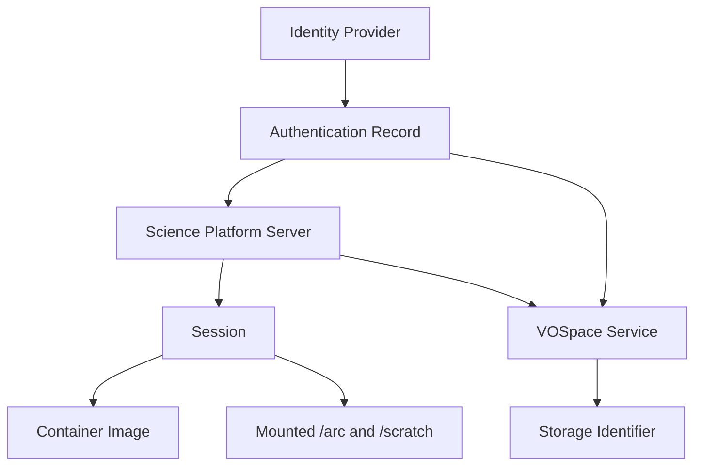
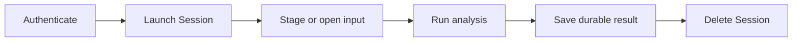

<span id="canfar-platform-concepts"></span>
<span id="canfar-science-platform-overview"></span>
<span id="platform-design-philosophy"></span>
<span id="platform-architecture"></span>
<span id="key-architectural-principles"></span>
<span id="platform-integration"></span>
<span id="understanding-platform-connections"></span>

# Platform concepts

CANFAR separates authenticated compute from the storage that holds research
data. A Science Platform Server launches user-owned Sessions from Container
Images, while VOSpace Services and mounted filesystems provide data access.



## Authentication and Server Selection

An **Identity Provider** issues the identity used to access CANFAR. An
**Authentication Record** stores the local credential state and its
Authentication Mode, such as X.509 or OIDC. A **Science Platform Server** is a
named endpoint discovered for that identity. **Server Selection** chooses the
Science Platform Server for new requests.

Changing Authentication or Server Selection affects new requests. It does not
move or change an existing Session.

From the CLI:

```bash
canfar login cadc
canfar auth show
canfar server ls
canfar server use NAME
```

The Python authentication and platform modules provide noninteractive
operations for scripts. See the [CLI reference](../cli/cli-help.md) and the
[Python client guide](../client/get-started.md).

<span id="session-fundamentals"></span>
<span id="session-types-interfaces"></span>

## Sessions

A **Session** is a compute environment for one user on one Science Platform
Server. It starts from a **Container Image**, has a **Session Kind**, and
requests a Resource Allocation Mode. Interactive kinds expose a browser
application; `headless` runs a command and exits.

Creation returns IDs before a Session is necessarily ready. `Pending` means the
platform is still admitting, scheduling, pulling, or initializing the Session;
it is not an application log or a guarantee of a queue position. Use
`canfar events`, `canfar info`, and `canfar ps --all` to inspect it. See
[Sessions](sessions/index.md) and [Batch processing](sessions/batch.md).

<span id="container-environments"></span>
<span id="container-fundamentals"></span>
<span id="traditional-vs-container-workflows"></span>
<span id="popular-canfar-containers"></span>
<span id="container-lifecycle-performance"></span>
<span id="container-registry-management"></span>

## Container Images

A **Container Image** is a reusable software environment. The image determines
the tools available after startup; the Session request determines how it is
used. Choose an image from `canfar image ls` or the Science Portal rather than
assuming that an example tag exists at every deployment.

Keep stable software and reproducible configuration in the image or a versioned
project repository. Treat changes made inside a running container as temporary
unless they are written to persistent storage or rebuilt into an image.

See [Containers](containers/index.md) and [Building Containers](containers/build.md).

<span id="storage-systems-data-management"></span>
<span id="data-persistence-fundamentals"></span>
<span id="arc-storage-arc-active-research-storage"></span>
<span id="vault-vospace-vosuserproject-long-term-object-storage"></span>
<span id="scratch-storage-scratch-high-performance-temporary"></span>
<span id="storage-strategy-best-practices"></span>
<span id="storage-quotas-management"></span>

## Storage

A Science Platform Session may expose persistent `/arc` paths and ephemeral
`/scratch`. Use `/arc/home/<user>` for personal files and
`/arc/projects/<project>` for shared project data when those mounts are
provided. `/scratch` is fast Session-local working space and is deleted with
the Session.

A Science Platform Server can expose one or more VOSpace Services. Each service
has a **Storage Identifier**. Use `canfar data` in a shell or
`canfar.storage.filesystem(identifier)` in Python. The identifier is a
configuration argument; CANFAR does not register dynamic `vault://` or `arc://`
protocols.

```bash
canfar data cp vault:/project/input.fits local:/scratch/input.fits
```

Use the mounted `/arc` path for data already there, stage remote data once when
a tool needs a local path, and write durable results outside `/scratch`. See
[Storage](storage/index.md).

<span id="core-benefits"></span>
<span id="sessions-computing-resources"></span>
<span id="resource-selection-guidelines"></span>
<span id="programmatic-platform-access"></span>

## Resource allocation modes

CPU, memory, and GPU requests are inputs to platform admission. Omit CPU and
memory for the flexible request or supply measured fixed values. A fixed request
can wait for matching capacity. Queue order and relative priority between
interactive and headless work are deployment policy; the Python client and CLI
do not promise an ordering.

Use `canfar stats` as a Science Platform Server-level capacity signal, not as a per-Session
explanation. For one workload, inspect its events and status.

<span id="storage-integration-automation"></span>
<span id="browser-based-access-automation"></span>
<span id="web-based-computing"></span>
<span id="key-api-services"></span>
<span id="automation-examples"></span>

## Scientific workflow

A typical workflow is:

1. Authenticate and select an available Science Platform Server.
2. Launch a suitable Session from a Container Image.
3. Read mounted data directly, or transfer remote data to `/scratch`.
4. Run the analysis and write durable outputs under `/arc` or a VOSpace Service.
5. Inspect outputs, then delete the Session when it is no longer needed.



For reproducible batch workflows, use `headless` plus the [distributed
helpers](../client/helpers.md). For visual analysis, choose Notebook,
Desktop, CARTA, or Firefly as appropriate.

<span id="system-components"></span>
<span id="architecture-components"></span>

<span id="recommended-learning-path"></span>
<span id="advanced-platform-usage"></span>

## Related concepts

- [Getting started](get-started.md)
- [Sessions](sessions/index.md)
- [Storage](storage/index.md)
- [Permissions](permissions.md)
- [Container Images](containers/index.md)
