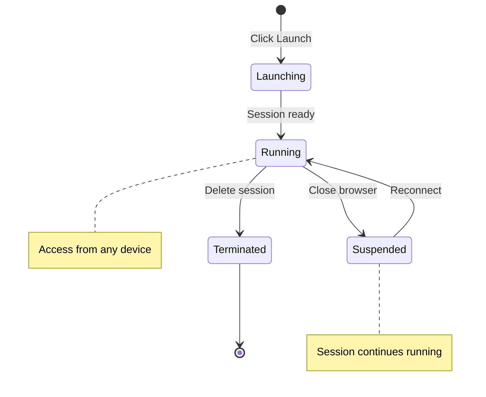

# Interactive Sessions

**Launch and manage interactive computing environments on CANFAR**

!!! abstract "🎯 What You'll Learn"
    - The differences between session types and when to use each
    - How to launch and connect to sessions quickly
    - How to size resources (RAM/CPU/GPU) appropriately
    - How to manage, share, and troubleshoot sessions

Interactive sessions provide web-based access to powerful computing resources with different interfaces optimized for specific workflows. Whether you're analyzing data in Jupyter notebooks, visualizing radio astronomy images, or running GUI applications, CANFAR's interactive sessions make it easy to get started.

## 🎯 Session Types Overview

CANFAR supports multiple interactive session types, each optimized for different research workflows:

| Session Type | Interface | Best For | Key Features |
|--------------|-----------|----------|--------------|
| **[📓 Notebook](launch-notebook.md)** | JupyterLab | Data analysis, coding, documentation | Interactive Python, visualization, markdown |
| **[🖥️ Desktop](launch-desktop.md)** | Linux desktop | Desktop GUI applications, legacy software | Full desktop environment, X11 apps |
| **[📊 CARTA](launch-carta.md)** | CARTA viewer | FITS/HDF5 astronomy visualization | Cube analysis, region tools, catalogues |
| **[🔥 Firefly](launch-firefly.md)** | Firefly viewer | Optical data, catalogue visualization | Image viewer, catalogue overlay, cutouts |
| **[⚙️ Contributed](launch-contributed.md)** | Various | Contributed web applications | Specialized tools, custom interfaces |

## 🚀 Quick Start Guide

### Step 1: Access the Science Portal

1. **Login** to [CANFAR Portal](https://www.canfar.net)
2. **Navigate** to "Science Portal" 
3. **Click** the plus sign (**+**) to create a new session

### Step 2: Choose Session Type

Select the interface that best matches your workflow:

=== "📓 Data Analysis"
    **Session Type:** `notebook`  
    **Container:** `astroml`  
    **Use Case:** Python analysis, Jupyter notebooks, data exploration

=== "📡 Visualize Astronomy Data" 
    **Session Type:** `carta`  
    **Container:** `carta`  
    **Use Case:** FITS/HDF5 data visualization, source analysis popular for radio astronomy

=== "🖥️ GUI Desktop Applications"
    **Session Type:** `desktop`  
    **Container:** `desktop`
    **Use Case:** CASA, DS9, TOPCAT, image viewers, legacy astronomy software tools

=== "🔬 Catalogue Analysis"
    **Session Type:** `firefly`  
    **Container:** `firefly`  
    **Use Case:** Optical data, catalogue overlays, image cutouts

### Step 3: Configure Resources

**Session Name:** Choose a descriptive name (e.g., "galaxy-photometry", "alma-reduction")

!!! tip "Choosing Resources"
    - Start with default: flexible
    - If you know the number of cores and memory you need, choose fixed. 
    - **Memory (RAM):**
        - 8GB: Light analysis, small datasets
        - 16GB: Default, suitable for most work
        - 32GB+: Larger datasets, memory-intensive tasks
    - **CPU Cores:**
        - 2 cores: Default, recommended for most tasks
        - 4+ cores: Parallel processing, intensive computations

### Step 4: Launch and Connect

1. **Click** "Launch" and wait for initialization (~30-60 seconds)
2. **Session appears** on your portal dashboard
3. **Click** the session icon to connect
4. **Start working** in your interactive environment

## 📱 Session Management

### Session Lifecycle



### Session Limits

| Limit | Value | Notes |
|-------|-------|-------|
| **Concurrent sessions** | 3 active sessions | Across all interactive session types |
| **Session duration** | 4 days maximum | Can be renewed indefinitely |
| **Idle timeout** | None | Sessions run until manually deleted |
| **Storage** | Persistent | Files saved to `/arc/` will persist |

### Managing Active Sessions

#### From the Science Portal

- **View all sessions:** Portal dashboard shows active sessions
- **Connect to session:** Click session icon
- **Extend session:** Use "Renew" button before expiration
- **Delete session:** Click "X" to terminate and free resources

#### From Command Line

```bash
# List your active sessions
canfar list

# Delete specific session ID
canfar delete <ID>
```

### Persistent Configuration

Save personal settings that persist across sessions:

```bash
# Jupyter configuration
mkdir -p /arc/home/$USER/.jupyter
cp jupyter_config.py /arc/home/$USER/.jupyter/

# Shell configuration
echo "alias ll='ls -la'" >> /arc/home/$USER/.bashrc

# Python packages (user installation)
pip install --user astroplan # in some containers, the --user may not be needed
```

#### External Access

Sessions are accessible from anywhere with proper authentication:

- **Same computer:** Original browser window
- **Different computer:** Copy session URL, login with CADC credentials  
- **Mobile device:** Session URL works in mobile browsers

## 🛡️ Security and Best Practices

### Data Security

**✅ Do:**
- Save important work to `/arc/projects/` or `/arc/home/`
- Use group permissions for collaborative data
- Regularly save and backup critical results in vault storage (`/arc` is not backed up)

**❌ Don't:**
- Store sensitive data in `/scratch/` (wiped at session end)
- Share session URLs publicly
- Leave sessions running unnecessarily
- Store passwords in plain text files

### Performance Optimization

#### Storage Performance

```bash
# Use /scratch/ for intensive I/O
cp /arc/projects/myproject/data.fits /scratch/
# ... process in /scratch/ ...
cp /scratch/results.fits /arc/projects/myproject/

```

### Troubleshooting Common Issues

#### Session Won't Start

**Problem:** Session stuck in "Launching" state

**Solutions:**
1. Check resource availability - try a fixed session with lower memory/CPU
2. Wait 2-3 minutes for container download
3. Try different container image
4. Contact support if persistent

#### Session Disconnected

**Problem:** Lost connection to running session

**Solutions:**
1. Refresh browser page
2. Click session icon again from portal
3. Check internet connection
4. Clear browser cache if needed

#### Out of Memory Errors

**Problem:** Application crashes with memory errors

**Solutions:**
1. Launch new session with more memory
2. Process data in smaller chunks
3. Use `/scratch/` for temporary files
4. Optimize code for memory efficiency

## 🔧 Troubleshooting Sessions

### Session Won't Start

**Problem:** Session creation fails or hangs

**Common Causes & Solutions:**

=== "Container Issues"
    **Solutions:**
    - Try a different container image (e.g., switch from custom to `astroml`)
    - Check if container is available: `docker pull images.canfar.net/container:tag`
    - Use `latest` tag instead of specific versions

=== "Network Problems"
    **Solutions:**
    - Check internet connection stability
    - Try different browser (Chrome/Firefox recommended)
    - Clear browser cache and cookies
    - Disable browser extensions temporarily

### Cannot Access Files

**Problem:** Files missing or permission denied

**Diagnostic Steps:**
```bash
# Check file locations
ls -la /arc/home/$(whoami)/     # Personal storage
ls -la /arc/projects/           # Available projects

# Check group membership  
groups

# Check permissions on specific files
ls -la /arc/projects/myproject/problematic_file
```

**Solutions:**
- Verify you're in the correct group via [Group Management](https://www.cadc-ccda.hia-iha.nrc-cnrc.gc.ca/en/groups/)
- Check file paths are correct (case-sensitive)
- Contact group administrator for access
- Try copying files to your home directory first

### Session Performance Issues

#### Memory Problems

**Problem:** Session crashes or becomes unresponsive

**Solutions:**
```bash
# Monitor memory usage
free -h
top -o %MEM

# Find memory-hungry processes
ps aux --sort=-%mem | head -10
```

**Best Practices:**
1. Close unused applications and browser tabs
2. Process data in smaller chunks
3. Use `/scratch/` for temporary files
4. Optimize code for memory efficiency
5. Request more memory when launching session

#### Slow Performance

**Problem:** Session responding slowly

**Diagnostic Commands:**
```bash
# Check system resources
htop           # Interactive process viewer
iostat 5       # I/O statistics
df -h          # Disk usage
```

**Solutions:**
1. Close unnecessary applications
2. Use `/scratch/` for I/O intensive tasks  
3. Consider requesting more CPU cores
4. Check for runaway processes
5. Restart session if persistent

### Connection Issues

#### Browser Problems

**Problem:** Can't connect to session or interface not loading

**Solutions:**
1. **Try incognito/private mode** - Eliminates extension conflicts
2. **Different browser** - Test Chrome, Firefox, Safari
3. **Clear browser data:**
   ```bash
   # Clear CANFAR-specific cookies and cache
   # In browser developer tools:
   Application -> Storage -> Clear site data
   ```
4. **Check browser requirements:**
   - JavaScript enabled
   - Cookies enabled
   - WebSocket support

#### Network Timeouts

**Problem:** Connection drops or times out

**Solutions:**
- Check stable internet connection
- Try wired connection instead of WiFi
- Contact network administrator about firewall/proxy
- Use VPN if on restricted network

### Storage Issues

#### Disk Space Problems

**Problem:** "No space left on device" errors

**Diagnostic Commands:**
```bash
# Check quotas and usage
df -h /arc/home/$USER
df -h /arc/projects/myproject
du -sh /arc/home/$USER/*

# Find large files
find /arc/home/$USER -type f -size +100M
```

**Solutions:**
1. Clean up large temporary files
2. Compress old data: `gzip large_file.fits`
3. Move old data to vault for archival
4. Use `/scratch/` for temporary processing
5. If necessary, request quota increase from support

#### File Transfer Problems

**Problem:** Uploads/downloads fail or are slow

**Solutions:**
```bash
# For large files, use rsync for reliability
rsync -av --progress source/ destination/

# Check network and resume transfers
wget -c https://example.com/large_file.fits

# Use vault VOSpace
vcp local_file.fits vos:myproject/
```

### Getting Help

When troubleshooting fails:

1. **Check logs** - Look for error messages in session logs
2. **System status** - Check [CANFAR status page](https://www.canfar.net) for maintenance
3. **Community help** - Ask on [Discord](https://discord.gg/vcCQ8QBvBa)
4. **Contact support** - Email [support@canfar.net](mailto:support@canfar.net) with:
   - Session ID
   - Container image used
   - Error messages
   - Steps to reproduce

!!! tip "Before Contacting Support"
    1. Try basic troubleshooting steps above
    2. Check if problem persists with default settings
    3. Test with different browser/device
    4. Gather specific error messages

## 🔗 Session-Specific Guides

Detailed guides for each session type:

- **[📓 Jupyter Notebooks →](launch-notebook.md)** - Interactive data analysis and visualization
- **[🖥️ Desktop Environment →](launch-desktop.md)** - GUI applications and legacy software
- **[📊 CARTA Viewer →](launch-carta.md)** - Radio astronomy cube visualization
- **[🔥 Firefly Viewer →](launch-firefly.md)** - LSST image and table visualization  
- **[⚙️ Contributed Apps →](launch-contributed.md)** - Community-developed tools

## 🔗 What's Next?

Once you're comfortable with interactive sessions:

- **[Storage Guide →](../storage/index.md)** - Manage data across sessions
- **[Batch Jobs →](../../batch-jobs.md)** - Automate workflows  
- **[Container Guide →](../../containers.md)** - Customize software environments
- **[Radio Astronomy →](../radio-astronomy/index.md)** - Specialized workflows

---

!!! tip "Session Success Tips"
    1. **Save frequently** - Important work should go in `/arc/` directories  
    2. **Share wisely** - Session URLs are powerful - only share with trusted collaborators
    3. **Monitor resources** - Keep an eye on memory and CPU usage with `htop`
    4. **Clean up** - Delete finished sessions to free resources for others
