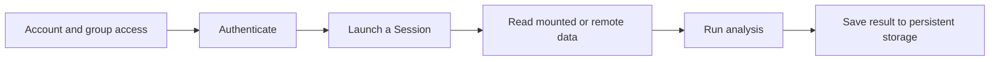

# CANFAR Science Platform

CANFAR provides authenticated compute and storage for astronomical research.
Launch a Session from a Container Image, work with mounted project storage or
configured VOSpace Services, and preserve results outside temporary compute.

## Choose a starting point

- [Get started](get-started.md) — account, first Session, and first workflow.
- [Agent Skill](agent-skill.md) — install the official skill and use CANFAR
  with your coding agent.
- [Platform concepts](concepts.md) — Authentication, Server Selection, Sessions,
  Container Images, and Storage Identifiers.
- [Sessions](sessions/index.md) — Notebook, Desktop, CARTA, Firefly, contributed,
  and headless workflows.
- [Storage](storage/index.md) — `/arc`, `/scratch`, VOSpace, fsspec, and data
  transfers.
- [Containers](containers/index.md) — choose or build a software environment.
- [Permissions](permissions.md) — accounts, groups, and access control.
- [Support](support/index.md) — troubleshooting and contact options.

## Typical workflow

Use the [Python client](../client/get-started.md) or [CLI](../cli/cli-help.md)
when the workflow should be repeatable from a script. Use the [Demos](../demos/srcnet-workshop.md)
for a guided command-line exercise.

## Community and publication

The [Community](community/index.md) pages collect domain workflows such as
ALMA. The [DOI guide](doi.md) describes the Data Publication Service. If you
use CANFAR in a publication, follow the [acknowledgement](../about/acknowledgement.md)
wording.

Deployment and operator material lives in [OpenCADC Deployments](https://www.opencadc.org/deployments/).
