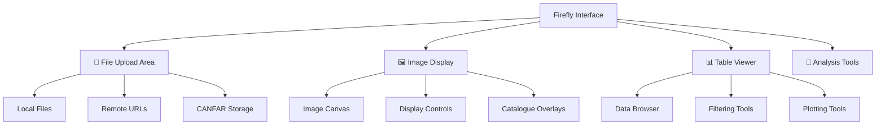

# Firefly Sessions

## The LSST table and image visualiser for astronomical data exploration

!!! abstract "🎯 What You'll Learn"
    - How to launch a Firefly session and choose the right version
    - How to load images, tables, and access CANFAR storage
    - How to perform catalogue overlays, plotting, and cutouts
    - Performance tips for large surveys and troubleshooting guidance

Firefly is a powerful web-based visualisation tool originally developed for the Rubin Observatory LSST. It provides advanced capabilities for viewing images, overlaying catalogues, and analysing tabular data - making it perfect for survey data analysis and multi-wavelength astronomy.

## 🎯 What is Firefly?

Firefly offers specialised tools for:

- **Image visualisation** with advanced stretch and colour controls
- **Catalogue overlay** and source analysis tools  
- **Table viewer** with filtering, plotting, and statistical tools
- **Multi-wavelength data** comparison and analysis
- **Large survey datasets** like LSST, HSC, and WISE

### Key Features

| Feature | Capability |
|---------|------------|
| **Image Display** | FITS images with WCS support, multiple panels |
| **Catalogue Overlay** | Plot sources on images, interactive selection |
| **Table Analysis** | Sort, filter, plot columns, statistical analysis |
| **Multi-band** | RGB colour composites, band switching |
| **Cutout Services** | Extract subimages from large surveys |
| **Coordinate Systems** | Support for all standard astronomical coordinates |

## 🚀 Launching Firefly

### Step 1: Create New Session

1. **Login** to the [CANFAR Science Portal](https://www.canfar.net/science-portal)
2. **Click** the plus sign (**+**) to create a new session
3. **Select** `firefly` as your session type


### Step 2: Choose Container

The container selection updates automatically after choosing the session type. Select the Firefly container version you need:


#### Available Versions

- **firefly:latest** - Most recent stable version (recommended)
- **firefly:X.X** - Specific version for reproducible analysis

!!! tip "Version Selection"
    Use the latest version unless you need a specific version for reproducibility. The latest version includes performance improvements and new features.

### Step 3: Configure Session

#### Session Name

Choose a descriptive name that helps identify your work:


**Good session names:**
- `lsst-photometry`
- `hsc-catalogue-analysis` 
- `multiband-survey`
- `gaia-cross-match`

#### Memory Requirements

If using a fixed resource session, select RAM based on your data size:

- **8GB**: Small catalogues, single images
- **16GB**: Default, suitable for most work
- **32GB**: Large catalogues, multiple images
- **64GB**: Very large survey datasets

!!! tip "Memory Planning"
    Large tables and multi-image layouts benefit from 32GB+ RAM. Start with 8GB and scale up if needed.

#### CPU Cores

Most Firefly work is I/O bound rather than CPU intensive:

- **2 cores**: Default, sufficient for most visualisation tasks
- **4 cores**: Large table operations, complex filtering


### Step 4: Launch Session

1. **Click** "Launch" button
2. **Wait** for container initialisation (~30-60 seconds)
3. **Session appears** on your portal dashboard
4. **Click** the session icon to access Firefly


## 🔥 Using Firefly

### Interface Overview

Firefly's interface consists of several main areas:



#### Main Components

- **File Upload Area**: Load local files, URLs, or access CANFAR storage
- **Image Display**: Multi-panel image viewer with WCS support
- **Table Viewer**: Advanced table browser with analysis tools
- **Control Panels**: Image display controls, colour maps, overlays

### Loading Data

#### Upload Local Files

**FITS Images:**

1. Click "Images" tab
2. Select "Upload" 
3. Choose FITS file from your computer
4. Image loads automatically with WCS if available

**Catalogue Tables:**

1. Click "Tables" tab
2. Select "Upload"
3. Choose CSV, FITS table, or VOTable
4. Table opens in browser interface

#### Access CANFAR Storage

**From ARC Projects:**

```bash
# Files in your project directory are accessible via:
/arc/projects/[project]/data/image.fits
/arc/projects/[project]/data/image_sources.csv
```

**From VOSpace:**

1. In Firefly, use "File" → "Open"
2. Navigate to VOSpace URLs
3. Access: `vos://cadc.nrc.ca~vault/[user]/`

#### Remote Data Access

**Survey Archives:**

```text
# Example URLs for Firefly
https://archive.stsci.edu/hlsp/data.fits
https://irsa.ipac.caltech.edu/data/WISE/cutouts/
```

**Supported Formats:**

- **Images**: FITS, JPEG, PNG
- **Tables**: CSV, FITS tables, VOTable, IPAC tables
- **Archives**: Gzipped files automatically handled

### Image Analysis

#### Basic Image Display

**Display Controls:**

1. Load FITS image
2. Adjust stretch (log, linear, sqrt)
3. Set scale limits (min/max values)
4. Choose colour table (heat, cool, rainbow)

**Navigation:**

- **Zoom**: Mouse wheel or zoom controls
- **Pan**: Click and drag
- **Centre**: Double-click to centre
- **Reset**: Reset zoom and pan to default

#### Multi-band RGB

**Creating RGB Composites:**

1. Load three images (e.g., g, r, i bands)
2. Select "RGB" mode
3. Assign each image to R, G, or B channel
4. Adjust relative scaling
5. Fine-tune colour balance

#### Coordinate Systems

Firefly supports standard coordinate systems:

- **Equatorial**: RA/Dec (J2000, B1950)
- **Galactic**: Galactic longitude/latitude
- **Ecliptic**: Ecliptic coordinates  
- **Pixel**: Image pixel coordinates

### Catalogue Analysis

#### Table Operations

**Basic Navigation:**

- **Sort columns**: Click headers to sort
- **Filter rows**: Use search box for text filtering
- **Select rows**: Click rows, Ctrl+click for multiple
- **Pagination**: Navigate large tables with page controls

**Advanced Filtering:**

```javascript
// Example filters (use in filter box):
magnitude < 20.5                         // Bright sources
colour_g_r > 0.5 && colour_g_r < 1.5     // Colour selection
distance < 100                           // Distance constraint
ra > 180 && ra < 200                     // RA range
```

#### Statistical Analysis

**Built-in Statistics:**

- **Column statistics**: Mean, median, std deviation
- **Histogram analysis**: Distribution plots
- **Cross-correlation**: Compare columns
- **Selection statistics**: Stats on filtered data

#### Plotting Tools

**Column Plots:**

1. Select table columns for X and Y axes
2. Choose plot type (scatter, histogram, line)
3. Apply colour coding by third column
4. Add error bars if available
5. Customise symbols and colours

**Image-Catalogue Overlay:**

1. Load image and catalogue table
2. Match coordinate columns (RA, Dec)
3. Select overlay symbol (circle, cross, diamond)
4. Adjust symbol size and colour
5. Sources appear overlaid on image

### Advanced Features

#### Cutout Services

Extract subimages from large surveys:

**Manual Cutouts:**

1. Right-click on image location
2. Select "Create Cutout"
3. Specify size (arcmin)
4. Choose format (FITS, JPEG, PNG)
5. Download or save to CANFAR storage

**Programmatic Cutouts:**

```python
# Example using Python and Firefly
import requests

url = "https://irsa.ipac.caltech.edu/cgi-bin/Cutouts/nph-cutouts"
params = {
    'mission': 'wise',
    'locstr': '10.68 +41.27',
    'sizeX': '300',
    'sizeY': '300'
}
response = requests.get(url, params=params)
```

#### Multi-wavelength Analysis

**Cross-band Analysis:**

1. Load images in different bands
2. Use "Blink" mode to compare
3. Create RGB composite
4. Overlay catalogue with colour-magnitude selection
5. Identify sources across wavelengths

**Spectral Energy Distributions:**

1. Load multi-band photometry table
2. Select source of interest
3. Plot flux vs wavelength
4. Fit SED models if available

#### Data Export

**Save Results:**

- **Modified tables**: CSV, FITS, VOTable formats
- **Image displays**: PNG, PDF for publications  
- **Analysis plots**: Vector formats for papers
- **Session state**: Save/restore workspace

**Export Options:**

```text
File → Export → [Format]
- Tables: CSV, FITS table, VOTable
- Images: FITS, PNG, JPEG, PDF
- Plots: PNG, PDF, SVG
- Session: Save current state
```

## 🛠️ Common Workflows

### Survey Photometry

**HSC/LSST Photometry Workflow:**

1. Load survey image (HSC, LSST, etc.)
2. Upload photometric catalogue
3. Overlay sources on image
4. Filter by magnitude and colour
5. Create colour-magnitude diagram
6. Export selected sources

```python
# Example: Filter for main sequence stars
# In Firefly filter box:
(g_mag - r_mag) > 0.2 && (g_mag - r_mag) < 1.0 && r_mag < 22
```

### Multi-object Analysis

**Target List Processing:**

1. Load target list (CSV with coordinates)
2. Create cutouts around each target
3. Measure properties in each cutout
4. Compile results in table
5. Plot trends and correlations
6. Save analysis products

### Cross-matching Catalogues

**Gaia Cross-match Example:**

1. Load your source catalogue
2. Load Gaia reference catalogue
3. Perform spatial cross-match
4. Analyse proper motions and parallaxes
5. Create clean stellar sample
6. Export matched catalogue

### Time Series Visualisation

**Light Curve Analysis:**

1. Load time-series table (time, magnitude, error)
2. Create light curve plot
3. Apply period folding if needed
4. Identify outliers and trends
5. Export cleaned data

## 🔧 Integration with CANFAR

### Storage Access

**ARC Projects:**

```bash
# Your project data appears in Firefly file browser
/arc/projects/[project]/
├── images/           # FITS images
├── catalogues/       # Source tables  
├── results/          # Analysis products
└── plots/            # Exported figures
```

**VOSpace Integration:**

```bash
# Access archived data
vos://cadc.nrc.ca~vault/[user]/
├── published_data/   # Public datasets
├── working_data/     # Analysis in progress
└── final_products/   # Paper-ready results
```

### Collaborative Features

**Session Sharing:**

1. Copy Firefly session URL
2. Share with team members (same CANFAR group)
3. Collaborate on analysis in real-time
4. Each user sees same data and visualisations

**Data Sharing:**

1. Save analysis results to shared project space
2. Export publication-quality figures
3. Share VOSpace links for external collaborators
4. Version control important datasets

### Working with Other CANFAR Tools

**Integration Patterns:**

- **Notebooks → Firefly**: Prepare data in Python, visualise in Firefly
- **Firefly → Desktop**: Export results for further analysis in CASA/DS9
- **Batch → Firefly**: Process large datasets, visualise results
- **CARTA → Firefly**: Radio analysis in CARTA, optical follow-up in Firefly

## 📊 Performance Tips

### Large Dataset Handling

**Memory Management:**

- Load subsets of large catalogues first
- Use server-side filtering when possible
- Close unused tables and images
- Monitor memory usage in browser

**Network Optimisation:**

- Use compressed file formats (gzip FITS)
- Access local files when possible (`/arc/projects`)
- Cache frequently used data locally
- Use cutout services for large images

### Visualisation Performance

**Image Display:**

- Use appropriate image size for screen resolution
- Apply reasonable stretch limits
- Close unused image panels
- Use PNG format for screenshots

**Table Operations:**

- Filter large tables before plotting
- Use sampling for very large datasets
- Index frequently used columns
- Batch operations when possible

**Browser Optimisation:**

- Use Chrome or Firefox for best performance
- Close other browser tabs to free memory
- Disable unnecessary browser extensions
- Use stable internet connection

## 🆘 Troubleshooting

### Common Issues

#### Firefly Won't Load

**Problem**: Firefly session doesn't start or shows blank screen

**Solutions:**

1. Check browser compatibility (Chrome, Firefox recommended)
2. Clear browser cache and cookies
3. Disable browser extensions that might interfere
4. Try incognito/private browsing mode
5. Wait for full session initialisation (up to 2 minutes)

#### Images Not Displaying

**Problem**: FITS images fail to load or display incorrectly

**Solutions:**

1. Verify FITS file format and WCS headers
2. Check file permissions and accessibility
3. Try loading smaller test image first
4. Ensure sufficient memory allocation
5. Check for corrupted files

#### Tables Not Loading

**Problem**: Catalogue tables won't open or display errors

**Solutions:**

1. Verify file format (CSV, FITS table, VOTable)
2. Check column headers and data types
3. Ensure proper delimiter in CSV files
4. Try loading subset of data first
5. Check for special characters in data

#### Performance Issues

**Problem**: Firefly responds slowly or becomes unresponsive

**Solutions:**

1. Reduce number of overlay sources
2. Close unused browser tabs
3. Increase session memory allocation
4. Use more efficient file formats
5. Filter large datasets before visualisation

### Getting Help

#### Firefly Documentation

- **[Firefly User Guide](https://firefly-help.ipac.caltech.edu/)**: Comprehensive documentation
- **[Video Tutorials](https://firefly-help.ipac.caltech.edu/firefly_help/videos.html)**: Step-by-step guides
- **[API Documentation](https://firefly-help.ipac.caltech.edu/firefly_help/api.html)**: For developers

#### CANFAR Support

- **Support Email**: [support@canfar.net](mailto:support@canfar.net)
- **Documentation**: [CANFAR Documentation](../)
- **Community**: [CANFAR Slack](https://canfar.slack.com)

## 📚 Learning Resources

### Firefly Tutorials

- **[Getting Started Guide](https://firefly-help.ipac.caltech.edu/)**: Basic operations
- **[Video Tutorials](https://firefly-help.ipac.caltech.edu/firefly_help/videos.html)**: Visual guides
- **[Advanced Features](https://firefly-help.ipac.caltech.edu/firefly_help/advanced.html)**: Power user tips

### Survey Data Resources

- **[LSST Data Portal](https://data.lsst.cloud/)**: LSST survey data
- **[HSC Archive](https://hsc.mtk.nao.ac.jp/)**: Hyper Suprime-Cam data
- **[IRSA](https://irsa.ipac.caltech.edu/)**: Infrared survey data
- **[Gaia Archive](https://gea.esac.esa.int/archive/)**: Astrometric and photometric data

### Python Integration

```python
# Example: Preparing data for Firefly
import pandas as pd
from astropy.io import fits
from astropy.table import Table

# Create catalogue for Firefly
sources = Table.read('my_sources.fits')
sources.write('/arc/projects/[project]/firefly_input.csv', 
               format='csv', overwrite=True)

# Save image for Firefly
hdu = fits.open('my_image.fits')
hdu.writeto('/arc/projects/[project]/firefly_image.fits', 
            overwrite=True)
```

## 🔗 Next Steps

- **[Try CARTA Sessions](carta.md)** for radio astronomy visualisation
- **[Use Notebook Sessions](notebook.md)** for quantitative analysis
- **[Explore Desktop Sessions](desktop.md)** for GUI applications
- **[Learn about Storage](../storage/index.md)** for managing large datasets
- **[Batch Processing](batch.md)** for automated survey analysis

## 🆘 Getting Help

- **Firefly Help**: Built-in help system in Firefly interface
- **Documentation**: [Firefly User Manual](https://firefly-help.ipac.caltech.edu/)
- **CANFAR Support**: [support@canfar.net](mailto:support@canfar.net)
- **Community**: [CANFAR Slack](https://canfar.slack.com)
