# CANFAR Storage Systems

**A guide to CANFAR's storage options for astronomy research: what they are, how to use them, and best practices for data management.**


!!! abstract "🎯 What You'll Learn"
    - The different storage systems available on CANFAR
    - How to choose the right storage for your workflow and data size
    - How to access storage (CLI, API, Web, SSHFS)
    - Best practices for data management, transfer, and backup
    - How to monitor usage and request more quota
    - Troubleshooting common issues


CANFAR provides several storage systems, each optimized for different research needs. Choosing the right storage type is crucial for efficient analysis, collaboration, and data safety.

## 📊 Types Comparison


## 📊 Storage Types Comparison

| Storage        | Mount Path / URI               | Access Speed   | Visibility         | Access Type      | Persistence         | Backup              | Quota         | Data Size Suitability | Best For                       |
|----------------|-------------------------------|----------------|--------------------|------------------|---------------------|---------------------|---------------|----------------------|-------------------------------|
| **ARC Projects** | `/arc/projects/[projectname]/` or `arc:projects/[projectname]/...` | Fast SSD       | Shared (group)      | File system, SSHFS, VOSpace API | ✅ Permanent         | ✅ Daily snapshots  | upon request   | Medium/Large         | Active research, shared data   |
| **ARC Home**    | `/arc/home/[username]/` or `arc:home/[username]/...`        | Fast SSD       | Personal            | File system, VOSpace API      | ✅ Permanent         | ✅ Daily snapshots  | 10GB default  | Small                | Personal configs, keys, code   |
| **Scratch**     | `/scratch/`                    | Fastest NVMe   | Session only        | File system      | ❌ Wiped at session end | ❌ No backup      | Unlimited     | Medium/Large         | Temporary processing           |
| **Vault (VOSpace API)** | `vos:[username]/...`              | Medium         | Shared/personal     | API, Web, FUSE   | ✅ Permanent         | ✅ Geo-redundant    | User/project  | Small/Medium/Large    | Archives, public data          |

**How to request more quota:** Contact CANFAR support or your project PI. Quota increases are subject to review.


## 🗺️ Storage Lifecycle Overview

CANFAR's storage architecture is designed around the astronomy research lifecycle:

```mermaid
graph LR
    Archive["📦 External Archives<br/>ALMA, HST, etc."] 
    Download["⬇️ Download"]
    Scratch["⚡ Scratch Storage<br/>Fast processing"]
    Process["🔄 Data Processing"]
    ARC["📁 ARC Projects<br/>Shared results"]
    VOSpace["☁️ VOSpace<br/>Long-term archive"]
    
    Archive --> Download
    Download --> Scratch
    Scratch --> Process
    Process --> ARC
    ARC --> VOSpace
    ARC -.-> |Backup| Process
```



---


## 📁 ARC Projects Storage (Shared)

ARC (Advanced Research Computing) storage provides high-performance, persistent storage for active research.


### `/arc/projects/[projectname]/` - Shared Research Storage


!!! success "When to Use ARC Projects"
    - Raw and processed datasets
    - Analysis scripts and notebooks
    - Results and publications
    - Shared team resources
    - Collaborative workflows
    - Data you want to share with your group

**🔧 Features:**


    - **Shared access** - All group members can read/write
    - **Fast SSD storage** - Optimized for data analysis
    - **Daily backups** - 30-day retention policy
    - **ACL support** - Fine-grained permission control
    - **Access via SSHFS** - Mount on your local computer
    - **Quota per project** - Request increases as needed


**📂 Recommended Project Directory Structure:**

```text
/arc/projects/myproject/
├── data/
│   ├── raw/              # Original observational data
│   ├── processed/        # Calibrated/reduced data  
│   ├── catalogs/         # Reference catalogs
│   └── simulations/      # Synthetic datasets
├── code/
│   ├── pipelines/        # Data processing workflows
│   ├── analysis/         # Analysis scripts
│   ├── notebooks/        # Jupyter notebooks
│   └── tools/            # Custom utilities
├── results/
│   ├── plots/            # Figures and visualizations
│   ├── tables/           # Output measurements
│   ├── papers/           # Manuscripts and drafts
│   └── presentations/    # Conference materials
└── docs/
    ├── README.md         # Project documentation
    ├── data_notes.md     # Dataset descriptions
    └── procedures.md     # Analysis procedures
```


## 🏠 ARC Home Storage (Personal)

### `/arc/home/[username]/` - Personal Space


!!! info "When to Use ARC Home"
    - Personal configuration files (`.bashrc`, `.jupyter/`)
    - SSH keys and authentication credentials
    - Personal scripts and utilities
    - Small reference files
    - Not for sharing or large datasets

**⚠️ Limitations:**


    - **10GB default quota** (contact support for increases)
    - Personal access only (not shared)
    - Not suitable for large datasets
    - Exceeding quota may result in errors; contact support


### Managing ARC Storage {#storage-management}


#### Check Usage and Quotas

```bash
# Check project storage usage
df -h /arc/projects/myproject

# Detailed usage breakdown
du -sh /arc/projects/myproject/*

# Check home directory usage
du -sh /arc/home/$USER/*

# Check available space
df -h /arc
```


#### Organising Data

```bash
# Create organised directory structure
mkdir -p /arc/projects/myproject/{data/{raw,processed,catalogs},code,results,docs}

# Set group permissions for collaboration
chmod -R g+rw /arc/projects/myproject/
chmod g+s /arc/projects/myproject/  # Inherit group ownership
```


#### Backup and Recovery

!!! tip "ARC Backup"
    ARC storage is automatically backed up daily with a 30-day retention policy. You can also restore files from snapshots if needed.

```bash
# List available snapshots (if enabled)
ls /arc/projects/myproject/.snapshots/

# Restore from snapshot
cp /arc/projects/myproject/.snapshots/daily.2024-03-15/important_file.fits \
   /arc/projects/myproject/restored_file.fits
```

---


## ⚡ Scratch Storage (Session Temporary)

Scratch provides the fastest storage available on CANFAR, but files are **temporary**.


!!! warning "Important: Scratch Storage Lifecycle"
    **Scratch storage is wiped at the end of each session.** When your interactive session ends or your batch job completes, all files in `/scratch/` are permanently deleted. There is no backup or recovery.

### When to Use Scratch

**✅ Use Scratch for:**
- Large intermediate files during processing
- Temporary downloads before organising in ARC
- High I/O operations requiring maximum speed
- Uncompressing large archives
- Sorting and filtering large datasets

**❌ Never use Scratch for:**
- Important results (will be lost!)
- Files you need to keep between sessions
- Shared data (only accessible within your session)

### Scratch Lifecycle


### Scratch Best Practices

```bash
# 1. Download large files to scratch first
cd /scratch
wget https://archive.alma.cl/large_dataset.tar.gz

# 2. Process immediately
tar -xzf large_dataset.tar.gz
casa --nologger -c "process_data.py"

# 3. Save results to permanent storage
cp processed_results.fits /arc/projects/myproject/data/processed/

# 4. Clean up isn't necessary (done automatically)
# but good practice during long sessions
rm large_dataset.tar.gz intermediate_*.fits
```

#### Multi-step Processing Workflow

```bash
#!/bin/bash
# Example: ALMA data reduction workflow using scratch

# Step 1: Download to scratch
cd /scratch
almaget 2019.1.00123.S

# Step 2: Process with CASA
casa --nologger --agg -c """
# CASA script here
execfile('/arc/projects/myproject/code/reduction_script.py')
"""

# Step 3: Save important results
mkdir -p /arc/projects/myproject/data/2019.1.00123.S/
cp *.image.fits /arc/projects/myproject/data/2019.1.00123.S/
cp *.uvfits /arc/projects/myproject/data/2019.1.00123.S/

# Step 4: Create processing log
echo "Processed $(date): 2019.1.00123.S" >> /arc/projects/myproject/processing_log.txt
```

---


## ☁️ Vault (VOSpace API Archive & Sharing)

The Vault is CANFAR's long-term archive storage, accessible only via the VOSpace API (vos: URIs, e.g., vos:username/...).
You can also access ARC storage via the VOSpace API using arc: URIs (e.g., arc:projects/myproject/mydatafile.fits).


!!! info "When to Use Vault (VOSpace API)"
    - Archives and public data
    - Long-term preservation
    - Sharing data with external collaborators
    - Metadata-rich datasets
    - Data you want to publish or share outside CANFAR


**🔧 Features:**
    - **Web-based access** - Upload/download via browser or command line
    - **Metadata support** - Store astronomical metadata with files
    - **Version control** - Track changes to datasets
    - **Sharing controls** - Fine-grained access permissions
    - **Geographic redundancy** - Multiple backup locations


**⚠️ Considerations:**
    - **Slower access** than ARC storage
    - **Best for archives, not active analysis**
    - **Requires account setup and permissions**
    - **Command-line tools required** for advanced features
    - **Vault is only accessible via VOSpace API (vos: URIs)**
    - **ARC storage can also be accessed via VOSpace API (arc: URIs)**


### Vault (VOSpace API) vs ARC Projects Comparison

| Use Case | Vault (VOSpace API) | ARC Projects |
|----------|---------------------|--------------|
| **Active analysis** | ❌ Too slow | ✅ Optimized |
| **Data sharing** | ✅ Web interface, API | ⚠️ Requires group membership |
| **Public releases** | ✅ Public URLs | ❌ Access controlled |
| **Long-term preservation** | ✅ Geo-redundant | ✅ Daily backups |
| **Large file processing** | ❌ Network overhead | ✅ Direct access |


### Using Vault and ARC via VOSpace API

#### Web Interface

Access Vault (VOSpace) through the CANFAR portal:
[**🔗 VOSpace File Manager**](https://www.canfar.net/storage/vault){ .md-button }

#### Command Line Tools

```bash
# Install VOSpace tools
pip install vostools

# List Vault contents
vls vos:myproject

# List ARC contents via VOSpace API
vls arc:projects/myproject

# Upload file to Vault
vcp local_file.fits vos:myproject/

# Upload file to ARC via VOSpace API
vcp local_file.fits arc:projects/myproject/

# Download file from Vault
vcp vos:myproject/data.fits ./

# Download file from ARC via VOSpace API
vcp arc:projects/myproject/mydatafile.fits ./

# Create directory in Vault
vmkdir vos:myproject/results

# Create directory in ARC via VOSpace API
vmkdir arc:projects/myproject/results

# Set permissions in Vault
vchmod o+r vos:myproject/public_data.fits  # Make publicly readable

# Set permissions in ARC via VOSpace API
vchmod o+r arc:projects/myproject/public_data.fits
```


#### VOSpace Python API

```python
import vos

# Create client
client = vos.Client()

# Upload file to Vault
client.copy("local_file.fits", "vos:myproject/survey_data.fits")

# Upload file to ARC via VOSpace API
client.copy("local_file.fits", "arc:projects/myproject/mydatafile.fits")

# Set metadata in Vault
node = client.get_node("vos:myproject/survey_data.fits")
node.props["TELESCOPE"] = "ALMA"
node.props["OBJECT"] = "NGC1365"
client.update(node)

# Set metadata in ARC via VOSpace API
node_arc = client.get_node("arc:projects/myproject/mydatafile.fits")
node_arc.props["TELESCOPE"] = "ALMA"
client.update(node_arc)

# Download with progress from Vault
client.copy("vos:myproject/large_file.fits", "local_copy.fits", send_md5=True)

# Download with progress from ARC via VOSpace API
client.copy("arc:projects/myproject/mydatafile.fits", "local_copy.fits", send_md5=True)
```

---


## 🔄 Data Transfers {#data-transfer-strategies}


!!! tip "Data Transfer Best Practice"
    Always move important results from `/scratch/` to `/arc/projects/[projectname]/` or VOSpace before ending your session. Use the right tool for your file size and workflow.


### Transfer Strategies by Data Size

#### Small Files (<1GB)
```bash
# Direct copy (fastest for small files)
cp /scratch/result.fits /arc/projects/myproject/results/

# VOSpace upload
vcp /arc/projects/myproject/final_catalog.fits vos:myproject/
```

#### Medium Files (1-100GB)
```bash
# Use rsync for reliability
rsync -av --progress /scratch/large_dataset/ /arc/projects/myproject/data/

# VOSpace with compression
vcp --enable-compression /arc/projects/myproject/datacube.fits vos:myproject/
```

#### Large Files (>100GB)
```bash
# Process in chunks
for file in /scratch/survey_*.fits; do
    # Process individual file
    process_file.py "$file" 
    # Save results immediately
    cp "${file%.fits}_processed.fits" /arc/projects/myproject/processed/
    # Remove processed input to save space
    rm "$file"
done
```


### SSHFS Setup for External Access (ARC Projects Only)

Mount CANFAR storage on your local computer:

```bash
# Install SSHFS (macOS with Homebrew)
brew install --cask macfuse
brew install sshfs

# Create mount point
mkdir ~/canfar

# Mount ARC storage
sshfs username@ws-uv.canfar.net:/arc/projects/myproject ~/canfar

# Work with files locally
ls ~/canfar
cp ~/local_analysis.py ~/canfar/code/

# Unmount when done
umount ~/canfar
```


#### SSHFS on Different Platforms

=== "macOS"
    ```bash
    # Install dependencies
    brew install --cask macfuse
    brew install sshfs
    
    # Mount
    sshfs username@ws-uv.canfar.net:/arc/projects/myproject ~/canfar
    ```

=== "Linux"
    ```bash
    # Install SSHFS
    sudo apt install sshfs  # Ubuntu/Debian
    # or
    sudo yum install sshfs  # CentOS/RHEL
    
    # Mount
    sshfs username@ws-uv.canfar.net:/arc/projects/myproject ~/canfar
    ```

=== "Windows"
    ```powershell
    # Install WinFsp and SSHFS-Win
    # Download from: https://github.com/billziss-gh/sshfs-win
    
    # Mount using SSHFS-Win GUI or command line
    ```

---


## 🛠️ Advanced Storage Operations


### Full VOSpace API Usage

#### Metadata Management

```bash
# Set custom metadata
vattr vos:myproject/observation.fits TELESCOPE ALMA
vattr vos:myproject/observation.fits OBJECT "NGC 1365"
vattr vos:myproject/observation.fits DATE-OBS "2024-03-15"

# View metadata
vattr vos:myproject/observation.fits
```

#### Advanced Permissions

```bash
# Make file publicly readable
vchmod o+r vos:myproject/public_catalog.fits

# Grant read access to specific group
vchmod g+r:external-collaborators vos:myproject/shared_data.fits

# Set up public directory
vmkdir vos:myproject/public
vchmod o+r vos:myproject/public
```


### Cutout Services

Access subsections of large files without downloading the entire dataset:

```python
import requests

# Get cutout from FITS file in VOSpace
cutout_url = "https://ws-cadc.canfar.net/vospace/data/myproject/large_image.fits"
params = {"cutout": "[1:100,1:100]", "format": "fits"}  # Section to extract

response = requests.get(cutout_url, params=params)
with open("cutout.fits", "wb") as f:
    f.write(response.content)
```


### Automated Data Workflows

```python
#!/usr/bin/env python
"""
Automated data processing workflow using multiple storage systems
"""
import os
import shutil
import vos
from pathlib import Path


def process_dataset(dataset_id):
    """Process a dataset using optimal storage strategy"""

    # 1. Download to scratch for fast processing
    scratch_dir = Path(f"/scratch/{dataset_id}")
    scratch_dir.mkdir(exist_ok=True)

    # Download from VOSpace to scratch
    client = vos.Client()
    client.copy(f"vos:archive/{dataset_id}.fits", str(scratch_dir / "raw_data.fits"))

    # 2. Process data (using scratch for speed)
    os.chdir(scratch_dir)
    # ... processing code here ...

    # 3. Save results to ARC projects
    results_dir = Path(f"/arc/projects/myproject/results/{dataset_id}")
    results_dir.mkdir(parents=True, exist_ok=True)

    # Copy important results
    shutil.copy("processed_image.fits", results_dir)
    shutil.copy("measurements.csv", results_dir)
    shutil.copy("processing.log", results_dir)

    # 4. Archive final products to VOSpace
    client.copy(
        str(results_dir / "processed_image.fits"),
        f"vos:myproject/processed/{dataset_id}_final.fits",
    )

    # Scratch cleanup happens automatically at session end
    print(f"Processed {dataset_id} successfully")


# Process multiple datasets
for dataset in ["obs001", "obs002", "obs003"]:
    process_dataset(dataset)
```

---


## 🔗 What's Next?

Now that you understand CANFAR's storage systems:

- **[VOSpace API Guide →](vospace-api.md)** - Advanced programmatic access and detailed transfer methods
- **[Interactive Sessions →](../interactive-sessions/index.md)** - Access storage from sessions
- **[Batch Jobs →](../../batch-jobs.md)** - Automated storage workflows
- **[Container Guide →](../../containers.md)** - Storage access in containers

---


!!! tip "Storage Strategy Summary"
    **Golden Rule:** Use `/scratch/` for fast temporary work, save everything important to `/arc/projects/[projectname]/`, and archive final results in VOSpace. Plan your data workflow around these three storage tiers for optimal performance and data safety.

---

## ❓ FAQ & Troubleshooting

**Q: How do I request more storage quota?**  
A: Contact CANFAR support or your project PI. Quota increases are subject to review.

**Q: Why can't I access my project directory?**  
A: You must be a member of the project group. Contact your PI or support to be added.

**Q: What happens if I exceed my quota?**  
A: You may get errors when writing files. Contact support for help.

**Q: Is my data backed up?**  
A: ARC Projects and ARC Home are backed up daily (30 days). Scratch is not backed up. VOSpace is geo-redundant.

**Q: How do I share data with external collaborators?**  
A: Use VOSpace and set permissions or public URLs.

**Q: Why is VOSpace slow?**  
A: VOSpace is network-based and best for archiving, not active analysis. Use ARC Projects for fast access.

**Q: How do I mount storage on my computer?**  
A: Use SSHFS for ARC Projects. See instructions above.

**Q: Who do I contact for help?**  
A: See the support section in the CANFAR portal or documentation.
